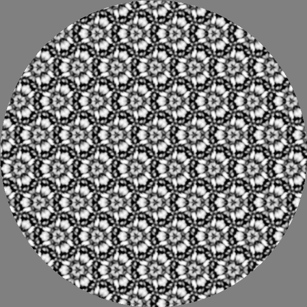
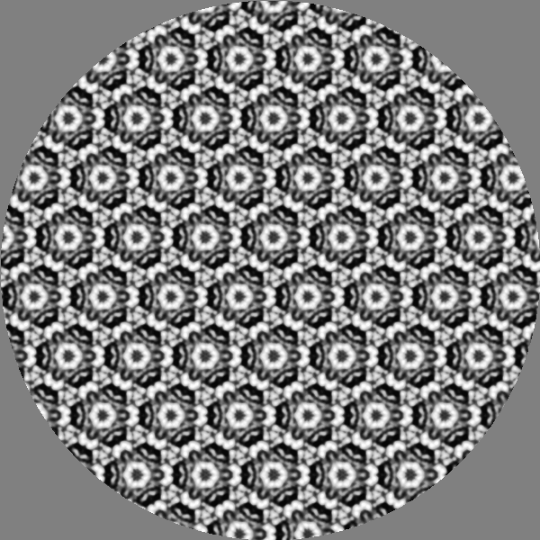
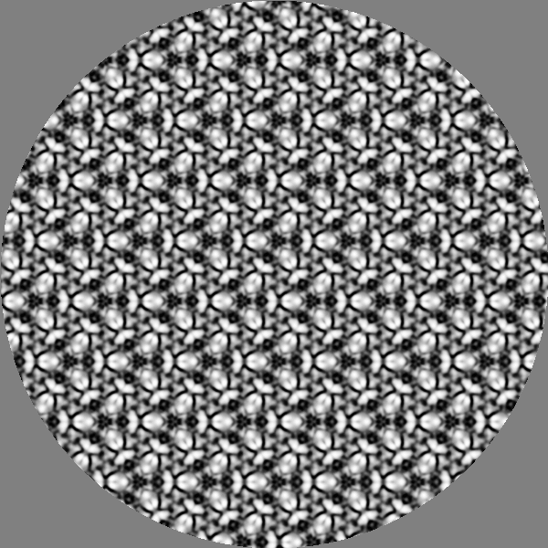
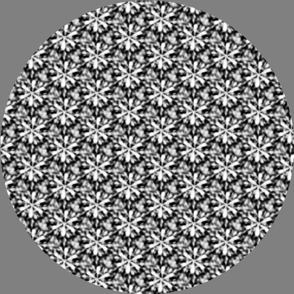
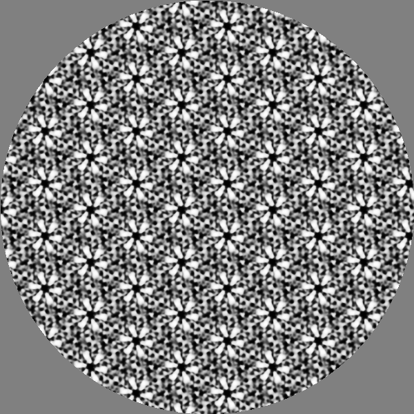
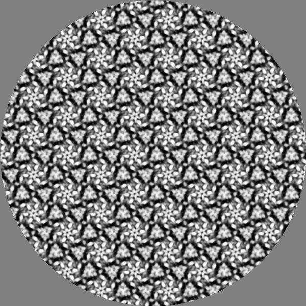
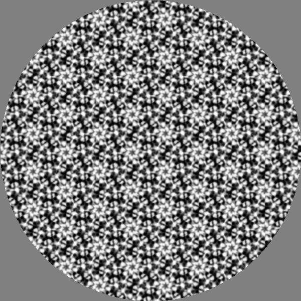
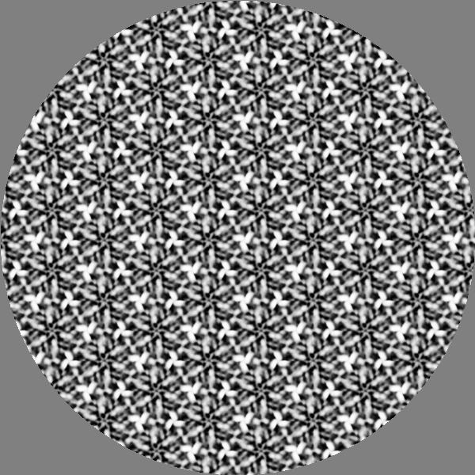

# Purpose

This document summarizes Rick Gilmore's analysis of participant sorting data.

# Set-up

```{r setup, include=FALSE}
knitr::opts_chunk$set(echo = TRUE)

library(tidyverse)
```

# Analysis plan

1. Did the wallpaper groups differ in terms of the *number of sets* into which exemplars were sorted? For example, Vedak et al., 2015 suggested that P1 exemplars were sorted into fewer sets.

2. Were there differences in mean *Jaccard indices* by wallpaper group?

# Import data

## N sets

The N sets data are found in `analysis/data/nsets.csv`.

```{r}
nsets <- readr::read_csv("analysis/data/nsets.csv")
```

There are $n=$ `r length(unique(nsets$Participant))` individual participants.

## Jaccard indices

The Jaccard index data are found in `analysis/data/jaccard.csv`.

There are 

```{r}
jaccard <- readr::read_csv("analysis/data/jaccard.csv")
```
# N sets data

## Visualizations

### N exemplars per set

Let's view the number of exemplars per set.

```{r}
exemplars_per_set_plot <- nsets %>%
  ggplot(.) +
  aes(x = Nsets, fill = Group) +
  geom_dotplot(method="histodot", dotsize = 1, binwidth = 1) +
  facet_grid(. ~ Group ) +
  xlab("Set size")
exemplars_per_set_plot
```

### N sets/participant and group

We can also calculate the number of sets per participant and wallpaper group.

```{r}
nsets_participant <- nsets %>%
  dplyr::group_by(., Participant, Group) %>%
  dplyr::summarise(., nsets_per = n())
```
```{r}
nsets_participant_plot <- nsets_participant %>%
  ggplot(.) +
  aes(x = nsets_per, fill = Group) +
  geom_dotplot(method="histodot", dotsize = 1.5, binwidth = 1) +
  facet_grid(. ~ Group ) +
  xlab("N sets")
nsets_participant_plot
```

## Analyses

### N exemplars

```{r}
n_exemplars_mod1 <- afex::aov_car(Nsets ~ Group + Error(Participant/Group), data = nsets)
summary(n_exemplars_mod1)
```

P1 exemplars were sorted into larger sets than other wallpaper groups.

```{r}
afex::afex_plot(n_exemplars_mod1, x = "Group", y = "Nsets")
```

### Set sizes

```{r}
set_size_mod1 <- afex::aov_car(nsets_per ~ Group + Error(Participant/Group), data = nsets_participant)
summary(set_size_mod1)
```
```{r}
afex::afex_plot(set_size_mod1, x = "Group", y = "Nsets")
```
Participants sorted P1 exemplars into a smaller number of categories than the other wallpaper groups.

# Jaccard index data

## Visualizations

```{r}
jaccard_plot_1 <- jaccard %>%
  ggplot(.) +
  aes(x = Jaccard, fill = Group) +
  geom_histogram() +
  facet_grid(. ~ Group)
jaccard_plot_1
```
```{r}
jaccard_plot_2 <- jaccard %>%
  ggplot(.) +
  aes(x = Jaccard, fill = Group) +
  geom_boxplot() +
  facet_grid(Group ~ .)
jaccard_plot_2
```

### Jaccard outliers

It may be useful to examine those exemplar pirs that have especially large Jaccard indices.

```{r}
jaccard_plot_4 <- jaccard %>%
  filter(., Jaccard > .35) %>%
  ggplot(.) +
  aes(x = Jaccard, fill = Group) +
  geom_boxplot()
jaccard_plot_4
```

So, P6 and P31M have a few highly similar exemplar pairs:

```{r}
jaccard %>%
  filter(., Jaccard > .35) %>%
  arrange(., Group, Exemplar.Row)
```
For P31M, Exemplars 2, 14, 19, and 20 were rated highly self-similar.

```{r, fig.show="hold", out.height="20%", out.width="20%", fig.align='default'}
knitr::include_graphics("img/P31M-2.png")
knitr::include_graphics("img/P31M-7.png")


```

```{r, fig.show="hold", out.height="20%", out.width="20%", fig.align='default'}


```

```{r, fig.show="hold", out.height="20%", out.width="20%", fig.align='default'}


```

For P6, 2, 6, 9, 13, and 19 were rated highly self-similar.

```{r, fig.show="hold", out.height="20%", out.width="20%", fig.align='default'}
knitr::include_graphics("img/P6-6.png")


```


```{r, fig.show="hold", out.height="20%", out.width="20%", fig.align='default'}



```

## Analyses

```{r}
jaccard_mod1 <- aov(Jaccard ~ Group, jaccard)
summary(jaccard_mod1)
anova(jaccard_mod1)
```
Average Jaccard similarity scores differ across wallpaper groups, with mean scores for P1 the largest.

Nevertheless, there appear to be a number of exemplar pairs in other wallpaper groups that have especially high Jaccard scores. Let's sort Jaccard indices across the wallpaper groups.

```{r}
jaccard_plot_2 <- jaccard %>%
  ggplot(.) +
  aes(x = Jaccard, fill = Group) +
  geom_boxplot() +
  facet_grid(Group ~ .)
jaccard_plot_2
```

```{r}
jaccard_sort <- jaccard %>%
  dplyr::arrange(., desc(Jaccard)) %>%
  dplyr::mutate(., overall_rank = 1:length(Jaccard))
```

```{r}
jaccard_plot_3 <- jaccard_sort %>%
  ggplot(.) +
  aes(x = overall_rank, fill = Group) +
  geom_boxplot() +
  facet_grid(Group ~ .)
jaccard_plot_3
```

```{r}
jaccard_mod2 <- aov(overall_rank ~ Group, jaccard_sort)
summary(jaccard_mod2)
anova(jaccard_mod2)
```
P1 still has the lowest mean rank.

